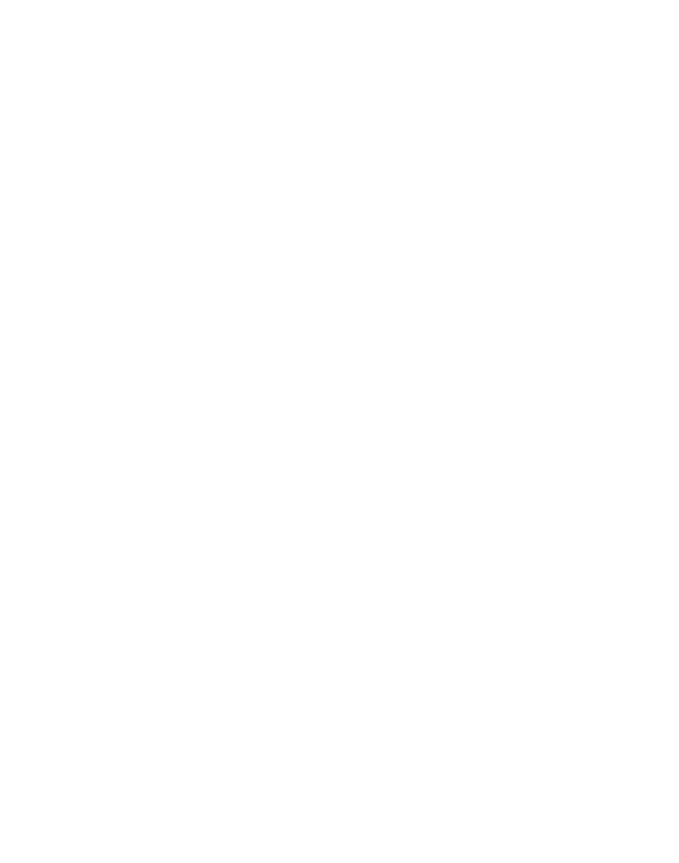

# [fit] GenStage
# [fit] & Flow

Poznań Elixir Meetup
25.05.2017

---


---

# Hi!

## Tymon Tobolski

- GitHub: **teamon**
- Twitter: **@iteamon**
- 8+ years with Ruby
- 2+ years with Elixir
- Currently Elixir+Dev+Ops @ Recruitee.com
- Hex: **tesla**, **mix_docker**

---


---


## The Job

---

# Library

```elixir
defmodule Poz do
  def select do
    items = Enum.to_list (1..100)
    :timer.sleep(:rand.uniform(100))
    Progress.incr(:select, length(items))
    items
  end

  def download(record) do
    :timer.sleep(:rand.uniform(100))
    Progress.incr(:download)
    {:file, record}
  end
```

---

# Library cont.

```elixir
  def extract(file) do
    :timer.sleep(:rand.uniform(10))
    Progress.incr(:extract)
    {:text, file}
  end

  def index(texts) do
    :timer.sleep(:rand.uniform(1000))
    Progress.incr(:index, length(texts))
    :ok
  end
end
```

---

# Example blueprint

```elixir
defmodule Example do
  import Poz

  def run do
    Progress.start_link([:select, :download, :extract, :index])

    # work work work

    Progress.stop()
  end
end
```

---

# Example 1 - `Enum`

```elixir
select()
|> Enum.map(&download/1)
|> Enum.map(&extract/1)
|> index()
```

---

# Example 1 - `Enum`


---

## Example 2 - `Stream`

```elixir
select()
|> Stream.concat([])
|> Stream.map(&download/1)
|> Stream.map(&extract/1)
|> Enum.to_list()
|> index()
```

---

## Example 2 - `Stream`


---

## Example 3 - `Task.async`

```elixir
select()
|> Enum.map(fn e -> Task.async(Poz, :download, [e]) end)
|> Enum.map(&Task.await/1)
|> Enum.map(fn e -> Task.async(Poz, :extract, [e]) end)
|> Enum.map(&Task.await/1)
|> index()
```

---

## Example 3 - `Task.async`


---


## Stages

---

## GenStage explained


---

## Example 4 - `GenStage` - SELECT


```elixir
defmodule Select do
  use GenStage

  def init(_), do: {:producer, :ok}

  def handle_demand(demand, :ok) do
    items = Poz.select()
    {:noreply, items, :empty}
  end

  def handle_demand(_demand, :empty) do
    {:noreply, [], :empty}
  end
end
```

---

## Example 4 - `GenStage` - DOWNLOAD


```elixir
defmodule Download do
  use GenStage

  def init(_), do: {:producer_consumer, :ok}

  def handle_events(items, _from, state) do
    files = Enum.map(items, &Poz.download/1)
    {:noreply, files, state}
  end
end
```

---

## Example 4 - `GenStage` - EXTRACT


```elixir
defmodule Extract do
  use GenStage

  def init(_), do: {:producer_consumer, :ok}

  def handle_events(files, _from, state) do
    texts = Enum.map(files, &Poz.extract/1)
    {:noreply, files, texts}
  end
end
```

---

## Example 4 - `GenStage` - INDEX


```elixir
defmodule Index do
  use GenStage

  def init(_), do: {:consumer, :ok}

  def handle_events(texts, _from, state) do
    Poz.index(texts)
    {:noreply, [], state}
  end
end
```

---

## Example 4 - `GenStage`


```elixir
{:ok, select}   = GenStage.start_link(Select, :ok)
{:ok, download} = GenStage.start_link(Download, :ok)
{:ok, extract}  = GenStage.start_link(Extract, :ok)
{:ok, index}    = GenStage.start_link(Index, :ok)

GenStage.sync_subscribe(download, to: select)
GenStage.sync_subscribe(extract, to: download)
GenStage.sync_subscribe(index, to: extract)

:timer.sleep(:infinity)
```

---

## Example 4 - `GenStage` *(defaults)*


---

## Example 5 - `GenStage` *(custom demand)*

```elixir, [.highlight: 6-8]
{:ok, select}   = GenStage.start_link(Select, :ok)
{:ok, download} = GenStage.start_link(Download, :ok)
{:ok, extract}  = GenStage.start_link(Extract, :ok)
{:ok, index}    = GenStage.start_link(Index, :ok)

GenStage.sync_subscribe(download, to: select, max_demand: 20)
GenStage.sync_subscribe(extract, to: download, max_demand: 20)
GenStage.sync_subscribe(index, to: extract, max_demand: 100)

:timer.sleep(:infinity)
```

---

## Example 5 - `GenStage` *(tuned demand)*


---

## Example 6 - `GenStage` *(multiprocess)*

```elixir, [.highlight: 4-11]
{:ok, select}     = GenStage.start_link(Select, :ok)
{:ok, extract}    = GenStage.start_link(Extract, :ok)
{:ok, index}      = GenStage.start_link(Index, :ok)

for i <- (1..10) do
  {:ok, download}  = GenStage.start_link(Download, i)
  GenStage.sync_subscribe(download, to: select, max_demand: 20)
  GenStage.sync_subscribe(extract, to: download, max_demand: 20)
end

GenStage.sync_subscribe(index, to: extract, max_demand: 100)
```

---


---

## Example 7 - `Flow`

```elixir
select()
|> Flow.from_enumerable(max_demand: 20)
|> Flow.partition(max_demand: 20, stages: 5)
|> Flow.map(&download/1)
|> Flow.partition(max_demand: 20, stages: 2)
|> Flow.map(&extract/1)
|> Flow.partition(window: Flow.Window.count(50), stages: 1)
|> Flow.reduce(fn -> [] end, fn item, list -> [item | list] end)
|> Flow.emit(:state)
|> Flow.partition(stages: 2)
|> Flow.map(&index/1)
|> Flow.run()
```

---

## Example 7 - `Flow`


---

## Real World


---

## Real World - optimised


---

## References

- [https://elixir-lang.org/blog/2016/07/14/announcing-genstage/](https://elixir-lang.org/blog/2016/07/14/announcing-genstage/)
- [https://hexdocs.pm/gen_stage/GenStage.html](https://hexdocs.pm/gen_stage/GenStage.html)
- [https://hexdocs.pm/flow/Flow.html](https://hexdocs.pm/flow/Flow.html)
- [http://teamon.eu/2016/tuning-elixir-genstage-flow-pipeline-processing/](http://teamon.eu/2016/tuning-elixir-genstage-flow-pipeline-processing/)
- [http://teamon.eu/2016/measuring-visualizing-genstage-flow-with-gnuplot/](http://teamon.eu/2016/measuring-visualizing-genstage-flow-with-gnuplot/)

---
# [fit] Thanks!
# [fit] **Questions?**
